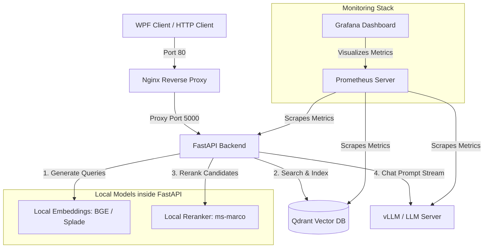

# hoboQRAG - Local RAG Pipeline

A completely local, production-grade Retrieval-Augmented Generation (RAG) pipeline designed for technical support search and chat. All components run offline, using local models for embedding generation, vector search, reranking, and LLM text generation.

## System Architecture

The following diagram illustrates the component relations and request routing in the system:



## Component Explanations

### 1. Nginx Reverse Proxy
Acts as the single gateway exposed to the Local Area Network (LAN). It publishes three ports to proxy incoming requests internally:
* Port 80: Reverse proxies HTTP calls to the FastAPI backend.
* Port 6333: Reverse proxies calls to the Qdrant Web UI Dashboard and HTTP REST API.
* Port 3000: Reverse proxies calls to the Grafana metrics visualization interface.

By routing all traffic through Nginx, direct LAN exposure is restricted for the underlying applications.

### 2. FastAPI Backend
The core application server that exposes REST API endpoints for collection management, document uploads, and similarity chats. It orchestrates the RAG pipeline stages, handles file text extraction and chunk splitting, and tracks Prometheus instrumentation metrics.

### 3. Local Embedding Models
Initialized locally inside the FastAPI process to convert text chunks into vector representations:
* Dense Embeddings: BAAI/bge-small-en-v1.5 mapping semantic context to 384 dimensions.
* Sparse Embeddings: prithivida/Splade_PP_en_v1 (via FastEmbed) for keyword-matching weightings.

### 4. Qdrant Vector Database
High-performance vector database storing both dense and sparse vectors. It supports hybrid search queries (combining dense vector proximity and sparse keyword retrieval) to fetch the top context candidates.

### 5. Local Reranker Model
Ms-marco-MiniLM-L-12-v2 cross-encoder model loaded inside the FastAPI process. It reranks the raw candidate chunks returned by Qdrant to ensure that the most relevant documents are pushed to the top before being fed into the LLM context.

### 6. vLLM / LLM Server
OpenAI-compatible inference server hosting the local offline LLM (Phi-4-mini-instruct). It receives compiled prompts containing context documents and streams responses token-by-token back to the FastAPI backend.

### 7. Prometheus & Grafana Monitoring
Prometheus scrapes operational metrics (like latency, count, and status codes) internally from the containerized services. Grafana visualizes these metrics on dashboards tracking pipeline performance and resource utilization.

## Running Tests

Automated tests are structured under `backend/tests/` and can be run using the runner scripts.

### Test Runner Options
* unit: Runs core component unit tests (Mocked models).
* api: Runs API endpoint verification checks.
* integration: Runs live connection tests.
* e2e: Runs a complete pipeline check.
* all: Runs the full test suite.

### How to Execute

On Linux:
```bash
./scripts/run_tests.sh unit
```

On Windows (PowerShell):
```powershell
.\scripts\run_tests.ps1 unit
```

### Deployed Smoke Checks
To check the status of a live deployment:
```bash
python scripts/smoke_test.py
```
